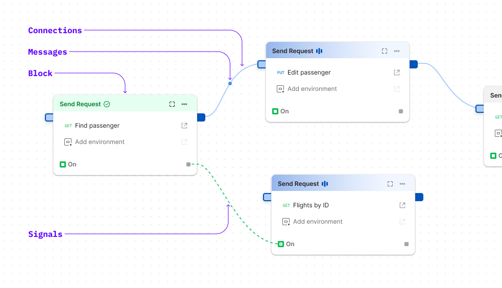

### A visual programming language for APIs 
[!embed](https://www.youtube.com/watch?v=4Yr9CG8Pp14)

Postman Flows is an API workflow builder that lets you connect APIs logically. Use Flows to chain requests, handle data and create real world workflows right in your Postman workspace.

Postman Flow is a beta feature and is available to members of all plans **_for free_**. 
Head on to [Postman web app](https://go.postman.co/) or use the latest version 
of [Postman desktop app](https://www.postman.com/downloads/) to start creating Flows.

## Fundamentals
There are just **4 fundamental** concepts that you need to know before starting
to use flows.

+++ Block
A **Block** is the basic unit of flows. There are various kind of blocks,
some *create data*, some *process data* and some *visualize data*. 
In the above example you can see three blocks which are capable of Sending a HTTP request.

To be able to send a request, the block might need some **input** like variable
and it might generate some **output** like the response. Every block is different but fundamentally 
it is a black-box process which takes in some input messages,executes and then generates output messages.

Additionally, a flow in itself can be considered as a block.

!!!success Important
1. A block to executable when all of it's **required** inputs are connected.
2. A block starts running when a message packet becomes available in all of its connected inputs.
3. A block is not a function but a process
!!!

+++ Messages
A **Message** is a single packet of data. A message could be a simple string or number, or it could be a
large complex data structure like an List of users, or maybe an entire Movie.

Data structures like Lists can also be converted to Streams which can be processed by blocks asynchronously.

!!!secondary Geek's Note
When message flow from one block another, the actual data does not move but a pointer to the message is passed along.
!!!

+++ Connection
A **Connection** is a data pipe which can be used to transfer messages from output of one block to the
input of another. Imagined them as FedEx like courier service that transfer mails and parcels between addresses.

!!!success Important
1. Connections don't store data, they just transmit.
2. Message can't be transmitted to an input if it already has a message. Messages wait in the
  output until the receivers completes processing the existing message.
3. When two connections are connected to the output, then a message is duplicated and sent
  to both connections.
4. When two connections are connected to the input and both have messages, they don't get merged, the block processes
  each message in a round-robbin fashion.
!!!

+++ Signal (advanced)
A **Signal** is a special kind of connection that does not carry data but a signal which is triggered when a block completes processing.

Very often execution happens in parallel, but there may be requirements to halt the execution of block until other blocks have completed their execution. 
In such cases the signal can be used to pause execution and synchronize. 

Signal ports also understand stream, so they don’t turn on until the entire stream has been processed.
+++

## Getting Started
* [The Interface](getting-started/interface.md)
* [The Block Anatomy](getting-started/blocks.md)
* [Data Types](getting-started/data-types.md)
* [Expressions & Operators](getting-started/operators.md)

## Tutorials
* [Level 1 - Sending a Request](tutorials/sending-a-request.md)
* [Level 2 - Chaining Requests](tutorials/chaining-requests.md)
* [Level 3 - Working with Access Tokens](tutorials/working-with-access-token.md)
* [Level 4 - Loops & Lists](tutorials/loops.md)

## Contribute

Flows is in beta and we're building it actively. We would love to hear what you're making with flows, what issues you face while doing so, and what new you'd like to see in Postman Flows.

Head on over to the [discussions page](https://github.com/postmanlabs/postman-flows/discussions) to start or join a conversation
