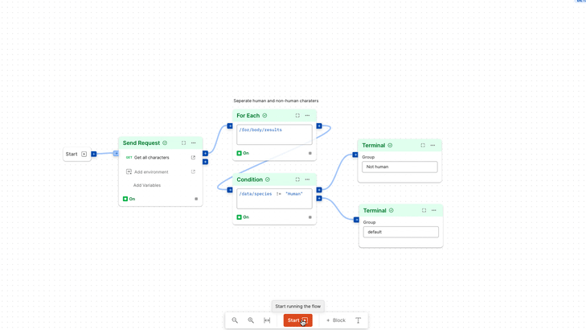
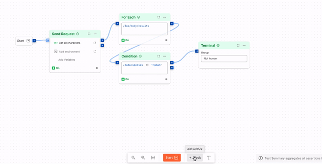
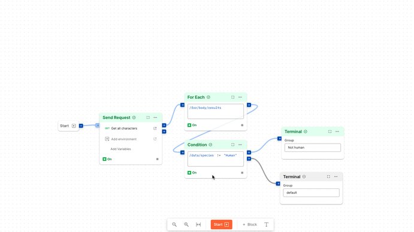

# The Interface

## Toolbar
The toolbar gives you access to tools you can use to manipulate the canvas.

+++ Zoom controls 
Use the toolbar to zoom in or out the canvas. Fit-to-view adjusts the zoom level to fit your entire flow on the visible canvas.

You can also hold down `ctrl`/`cmd` scroll to zoom in or out

+++ Start
Use the start button to execute the flow you've built on the canvas. the start button changes to stop during an active run, which can be used to, well, stop the flow.

+++ Add Block
The tool bar lets you add a block to the canvas as well. Click on the `+ Block` button and you're presented with a list of the available blocks

+++ Text
You can add rich markdown on the canvas to describe what your flow is doing. Just click on the `T` or Text icon on the toolbar and place the text block on the canvas.

+++

## Context bar
The context bar is the place where you'll see more information about your flow and it's current state.

+++ Terminal
If you have connected the [terminal block](../blocks/terminal.md) to any output, you'll see the output being logged in the Terminal section of the context bar. 
You can specify a group for the terminal and view that specific group from the context bar too.

+++ Test Summary
Similar to the terminal, you can connect the "Test" port of a "[Send request"](../blocks/send-request.md) block to a [Test summary](../blocks/test-summary.md) block and see the test results in the context panel. 
Test summary also supports groups like the Terminal.

+++ Execution Errors
When your flow encounters an error while running, you can read the logs in the context bar's "Execution error" section

+++ Flow Information
You can see the flow ID and add a summary for your flow in the "Info" section
+++