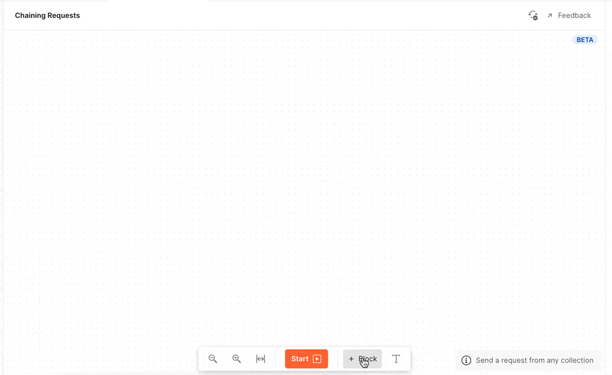
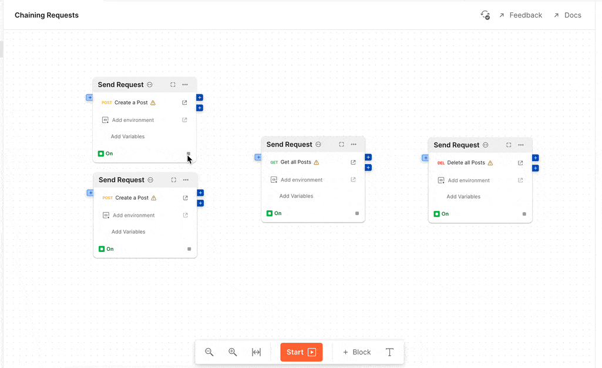
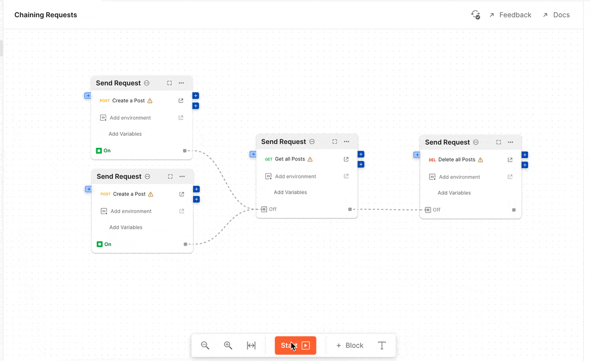
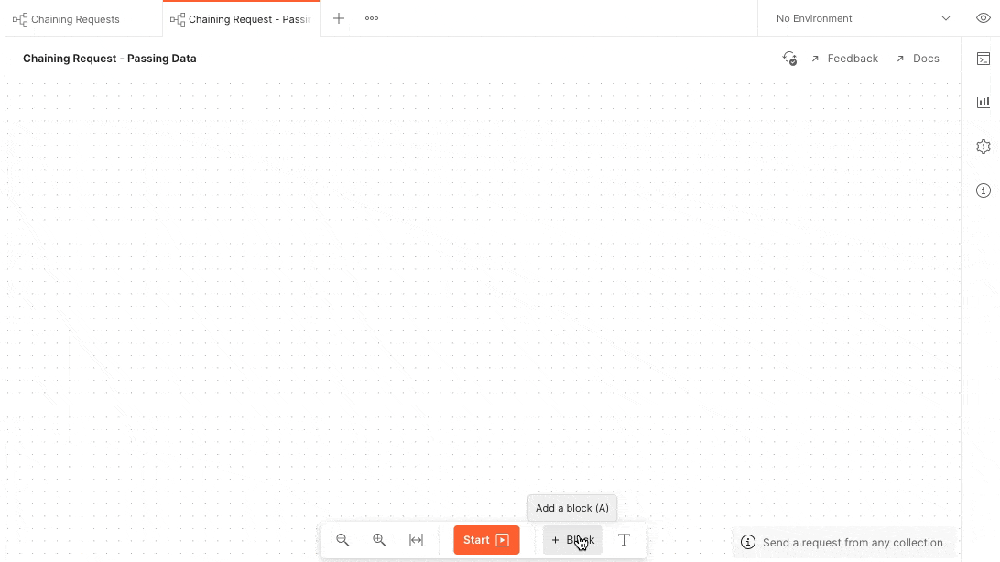
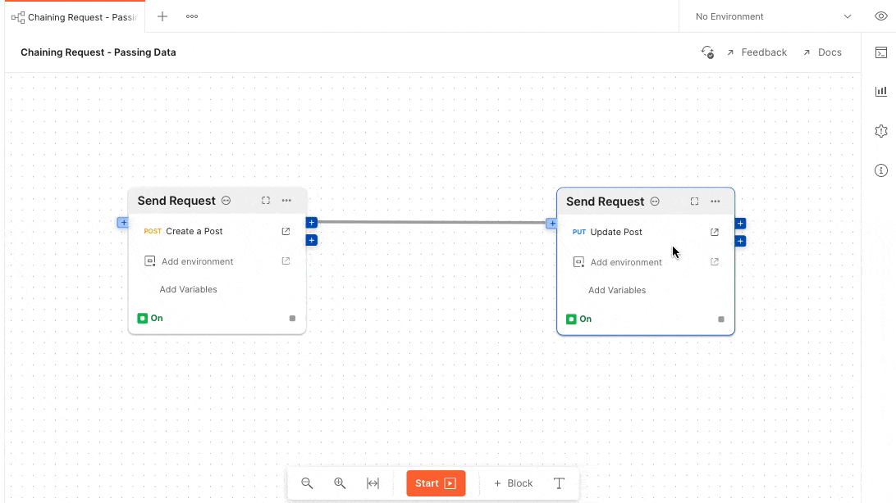

# Level 2 - Chaining requests

Chaining request is the ability of send one request after another either in serial or parallel.

## Simple
If you have a bunch of simple requests that have no dependency on each other but
they have to be executed in a particular order, it's as simple as

### 1. Add the [Send Request](./../blocks/send-request.md) blocks
Click on the `+ Block` button on the toolbar and select the [Send Request](./../blocks/send-request.md) from the list to add to your canvas, then select the request. Repeat this
setup until all the requests are added to the canvas.



### 2. Connect the signals
Click on the grey dot (signal output) of the source block and connect it to 
signal input of the target block in the order you want the requests to execute.

Here, two `Create a post` are executed in parallel. When both of the request has completed,
the `Get all posts` endpoint is called, and then finally `Delete all posts is called`.

!!!success Important
1. When a signal connection is made the input become disabled to show that it will get enabled
   after the previous blocks get enabled.
2. The signal connection depict exactly the order in which the blocks will be executed.
3. When using signal no data is passed from one block to another.
4. Two or more connections can be made to an input. The block will execute only when all signals
   have got enabled.
!!!

### 3. Start the Flow
Start the flow see them run in the order they are configured!



## Passing Data
A very common use-case of chaining requests is the ability to pass data from one block to another.
Let's consider an example where want to create a post and then want to use the id of that post in the
next request to update it.

### 1. Add two [Send Request](./../blocks/send-request.md) blocks
Add two [Send Request](./../blocks/send-request.md) blocks by clicking on the `+ Block`
button on the toolbar. Select the `Create a Post` for the first request and `Update Post` request for the second.


### 3. Pipe the message from output to input
Now we need to tell the flow how the message should _flow_. To do that, connect the `response` output of the first block to the `variables`input of the second block.


!!!success
1. On flow execution, the output message from the source block is passed over 
   to the input of the target block using the pipe connection.

2. When using pipes to connect blocks, signal connections are **optional**. Flows
   automatically decides the order in which the blocks should execute based on 
   connections. (Signal can be used explicitly to manually override the order of
   execution)
!!!

### 4. Check the output in the terminal
At this point we don't really know what the output of the `Send Request` looks like.
So let's add the [Terminal](../blocks/terminal.md) block to see the output.


The output has the following structure and the `id` is present in the body.
```yaml
body:
   id: 1
headers:
   ...
http:
   statusCode: 200
   statusMessage: OK
   responseTime: 1900
```

### 4. Use message in Request variables
For the sake of simplicity, Flows flattens complex object to a simple
key-value pairs in the Send Request block. So the above message get's converted to
the following, and you will be able to use in your requests.
```yaml
body.id: 1
headers.content-type: application/json
...
http.statusCode: 200
http.statusMessage: OK
http.responseTime: 1900
```


### 5. Start the Flow
Start the flow and the data will _flow_ through!


You can observe that the request sent has the path param set to `1` which we
obtained from the `body.id`

---

!!!warning
The rest of this tutorial is under-construction
!!!

## Conditional

There might be situations where we want to conditionally send the second request.

### 1. Add an `Example` to the first request. (Important)

### 2. Add a `Condition` block in-between the first and second request.

### 3. Add a `truthy` expression to conditionally pipe the data from first request to second

### 4. Start the Flow