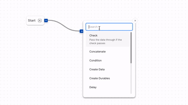
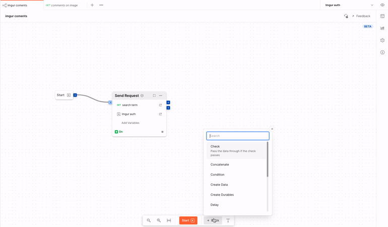
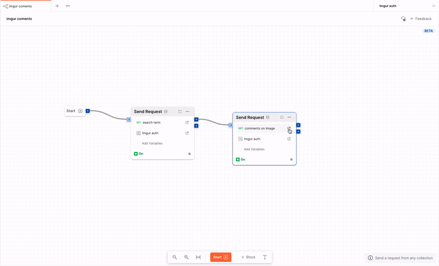
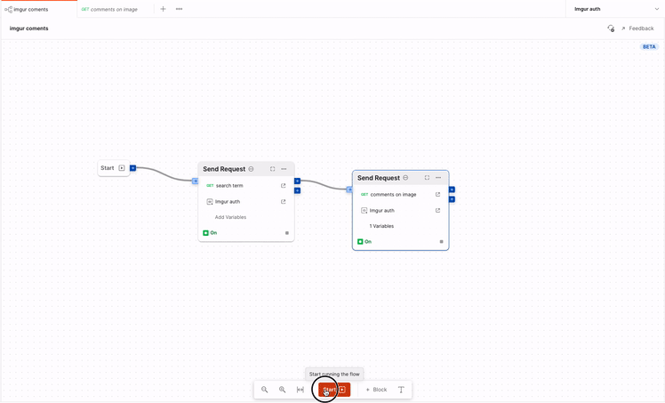

# Level 2 - Chaining requests

## Simple
If you simply want to pick some data from a response and pipe that to another request, follow along:

### 1. Add a `Send Request` block 
Add a new [send request](./../blocks/send-request.md) from the block list to the canvas and select the first request you want to send.

### 2 Add another `Send Request` block 
Add another `Send request` block and add the request you want to send the data to here 

### 3. Pipe the data
Now we need to tell the flow where the data should _flow_. To do that, COnnect the `response` output of the first block to the `variables`input of the second block.

### 4. Use the variables
To tell the request what to use from the input received, you use variables. Create a template variable in the request where you want the data to fit in. 
Then in the flow, click on `Add Variables`, select the name of the variable and assign it data comming in from the input port `Variables`.

### 5. Start the Flow
Start the flow and the data will _flow_ through!

## Conditional

!!!warning
This tutorial is under-construction
!!!

There might be situations where we want to conditionally send the second request.

### 1. Add an `Example` to the first request. (Important)

### 2. Add a `Condition` block in-between the first and second request.

### 3. Add a `truthy` expression to conditionally pipe the data from first request to second

### 4. Start the Flow